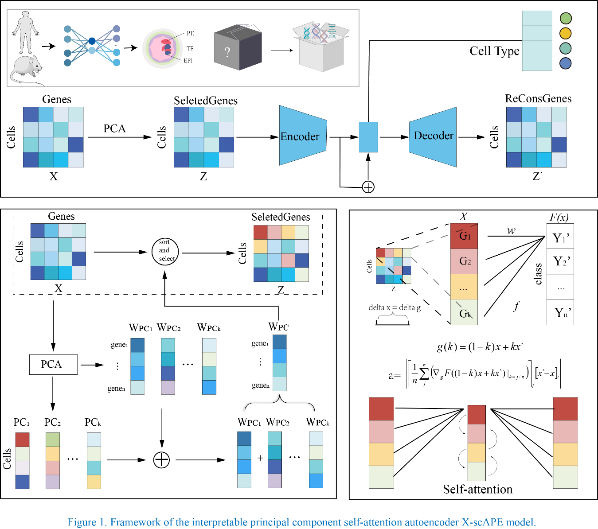

# X-scPAE

`X-scPAE` (eXplained Single Cell PCA - Attention Auto Encoder) is an advanced deep learning model that predicts cell lineage allocation and identifies lineage differences in human and mouse single-cell transcriptome data. 
This model integrates Principal Component Analysis (PCA) for dimensionality reduction, a self-attention mechanism for feature interaction, and Counterfactual Gradient Attribution (CGA) for computing feature importance, providing accurate and interpretable lineage predictions.



## Features

- **High Accuracy**: Achieves outstanding performance with an accuracy of 94.5% on the test set.
- **Interpretability**: Utilizes Integrated Gradients for model interpretation, allowing for the identification of key genes influencing lineage allocation.
- **Cross-Species Application**: Demonstrates robust performance across human and mouse datasets.
- **Dimensionality Reduction**: Efficiently reduces data dimensions using PCA while retaining important features.
- **Attention Mechanism**: Captures feature interactions to enhance model representation.

## Getting Started

Ensure you have the following prerequisites installed:
- Python >= 3.9.x
- PyTorch == 2.5.0 
- NumPy >= 1.24.3
- Pandas >= 2.2.2
- Matplotlib >= 3.8.4
- Scikit-learn == 1.4.2
-scipy == 1.10.1

You can install the required packages using `pip`:

```bash
pip install torch numpy pandas matplotlib scikit-learn
```

### Installation

To use the `X-scPAE` model, clone the repository:

```bash
git clone https://github.com/bowei-color/X-scPAE.git
```

Create a virtual environment using conda:

```bash
conda create --name environment_for_xscpae python=3.9
```

Activate the virtual environment

```bash
conda activate environment_for_xscpae
```

Navigate to the project directory

```bash
cd X-scPAE/code
```

### Usage

To run the model with the provided dataset, execute the following command:

```python
python X-scPAE.py --epochs[number of iterations] --file_path[your data file path]
```

## Input structure

X-scPAE implements a multi-class classification task, with inputs including labels and features, where the first column consists of labels in numerical form, and the same number indicates the same category.

### Example for data:

```bash
Label Feature1  Feature2   Feature3 ...
  1    0.235     1.378      3.546
  2    10.731    0.556      6.034
  5    3.265     2.931      2.878
  8    5.307     4.251      11.215
```


## Documentation
The project documentation provides a detailed description of the model, the logic of the algorithm, an explanation of the parameters, and a guide on how to reproduce the experimental results. Here is a summary of the documentation:

- **Model Architecture**: The X-scPAE model combines PCA for dimensionality reduction and a self-attention mechanism to enhance the expressiveness of the features.
- **Algorithm Logic**: The model employs the integrated gradients method to provide interpretability of decisions, helping to identify key features that affect predictions.
- **Parameter Explanation**: A detailed list of all parameters involved in the model training and prediction processes and their functions.

## Results
Our model has been tested on multiple datasets, and here is a summary of some key results:

- **Accuracy**: The model achieved an average accuracy of 94.5% on both human and mouse single-cell transcriptome datasets.
- **Performance Metrics**: In addition to accuracy, the model also performed well in precision, recall, and F1 score.
- **Model Comparison**: Compared to existing methods, X-scPAE has shown significant improvements across various evaluation metrics.

## Contributing

Contributions to the project are welcome. Please submit a pull request or create an issue in the GitHub repository.

## Contact Authors

Dr. Bowei Yan: boweiyan2020@gmail.com
